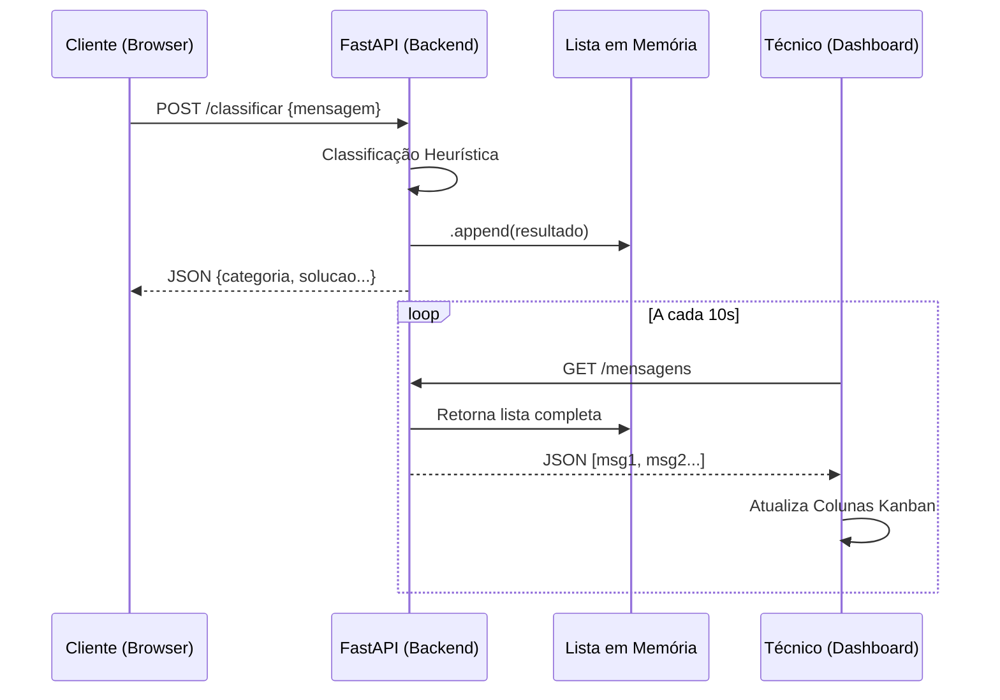

# Tutorial Técnico: API de Classificação de Mensagens

Este projeto implementa uma API RESTful simples usando **FastAPI** para classificar mensagens de texto em categorias como "Financeiro/Vendas", "Suporte Técnico", "Saudação" e "Outros". A classificação é feita através de heurísticas (palavras-chave) definidas internamente.

## 📋 Requisitos Pré-requisitos

Para rodar este projeto, você precisará de:

- **Python 3.8+** instalado.
- **pip** (gerenciador de pacotes do Python).

## 🚀 Instalação e Configuração

Siga os passos abaixo para preparar o ambiente de execução:

1.  **Clone o repositório** (se aplicável) ou navegue até a pasta do projeto:
    ```bash
    cd c:\Users\morei\OneDrive\Desktop\avaliacaoback
    ```

2.  **Instale as dependências**:
    Todas as bibliotecas necessárias estão listadas no arquivo `requirements.txt`. Instale-as executando:
    ```bash
    pip install -r requirements.txt
    ```
    *Dependências principais:* `fastapi`, `uvicorn`, `pydantic`.

## ▶️ Como Rodar a API

Existem duas formas principais de iniciar o servidor:

### Opção 1: Via Python direto (Simples)
O arquivo `main.py` já contém um bloco de configuração para rodar o servidor na porta 8080.
```bash
python main.py
```
Você verá a saída confirmando que o servidor iniciou em `http://127.0.0.1:8080`.

### Opção 2: Via Uvicorn (Recomendado para Desenvolvimento)
Para ter *hot-reload* (atualização automática ao salvar o código) e logs mais detalhados:
```bash
uvicorn main:app --reload --port 8080
```

## �️ Acesso às Interfaces

O sistema possui duas áreas distintas:

### 1. 👤 Portal do Cliente
**URL:** [http://localhost:8080/](http://localhost:8080/)
- Interface para envio de solicitações.
- O usuário digita o problema e recebe uma **classificação**, **explicação** e **solução sugerida** na hora.

### 2. 🔧 Painel do Técnico
**URL:** [http://localhost:8080/tecnico](http://localhost:8080/tecnico)
- Dashboard estilo Kanban.
- Exibe todas as mensagens recebidas, organizadas por colunas (Financeiro, Suporte, Saudação, Outros).
- Atualiza automaticamente a cada 10 segundos.

## 🔍 Testando via API (Opcional)
Se preferir testar via API direta:
O FastAPI gera automaticamente uma documentação interativa.
- Acesse: [http://localhost:8080/docs](http://localhost:8080/docs)
- Clique no endpoint `POST /classificar` -> **Try it out**.
- Edite o JSON e clique em **Execute**.

### 2. Usando Endpoint de Classificação
O endpoint principal é `POST /classificar`.

**Exemplo de Corpo da Requisição (JSON):**
```json
{
  "mensagem": "Estou com um erro no sistema e preciso de ajuda"
}
```

**Exemplo de Resposta:**
```json
{
  "categoria": "Suporte Técnico",
  "confianca": "alta"
}
```

### 3. Exemplos via Terminal (cURL)

**Financeiro:**
```bash
curl -X POST "http://localhost:8080/classificar" -H "Content-Type: application/json" -d "{\"mensagem\": \"Qual o preço do produto?\"}"
```

**Suporte:**
```bash
curl -X POST "http://localhost:8080/classificar" -H "Content-Type: application/json" -d "{\"mensagem\": \"Encontrei um bug no login\"}"
```

**Saudação:**
```bash
curl -X POST "http://localhost:8080/classificar" -H "Content-Type: application/json" -d "{\"mensagem\": \"Bom dia equipe\"}"
```

## 🧠 Lógica de Classificação

O sistema utiliza uma verificação heurística simples (procura por palavras-chave na string normalizada):

| Categoria | Palavras-chave |
|-----------|----------------|
| **Financeiro/Vendas** | `preço`, `comprar`, `custo` |
| **Suporte Técnico** | `erro`, `falha`, `ajuda`, `bug` |
| **Saudação** | `olá`, `bom dia` |
| **Outros** | Qualquer mensagem que não contenha as palavras acima. |

## 🏗️ Estrutura do Projeto

- `main.py`: Código fonte principal contendo a API, modelos de dados e lógica de classificação.
- `requirements.txt`: Lista de pacotes necessários.
- `README.md`: Este tutorial.
- `.gitignore`: Arquivo para ignorar arquivos desnecessários no Git.

## 🧠 Arquitetura e Detalhes Técnicos

Esta seção detalha o funcionamento interno da solução para fins de manutenção e entendimento técnico.

### Fluxo de Dados

1.  **Entrada**: O cliente envia um JSON via `POST /classificar`.
2.  **Processamento**:
    *   O `main.py` recebe a requisição e valida o corpo usando `Pydantic`.
    *   A função `classify_message_logic` normaliza o texto (lowercase) e verifica a presença de palavras-chave.
    *   Retorna um objeto contendo: `categoria`, `explicacao` (motivo), `solucao` (ação) e `confianca`.
3.  **Persistência (In-Memory)**:
    *   O resultado é anexado a uma lista global `db_messages` na memória RAM do servidor.
    *   *Nota: Se o servidor for reiniciado, os dados são perdidos (by design para este protótipo).*
4.  **Consumo (Dashboard)**:
    *   O painel do técnico (`tecnico.html`) faz polling a cada 10 segundos no endpoint `GET /mensagens`.
    *   O Javascript no frontend filtra as mensagens e as distribui nas colunas Kanban.

### Diagrama de Sequência (Simplificado)



### Extensibilidade

Para adicionar novas categorias, basta editar a função `classify_message_logic` em `main.py`:
1.  Adicione uma nova lista de keywords (ex: `marketing_keywords`).
2.  Adicione um novo bloco `if` verificando essas keywords.
3.  Atualize o `tecnico.html` para criar uma nova coluna para essa categoria.
