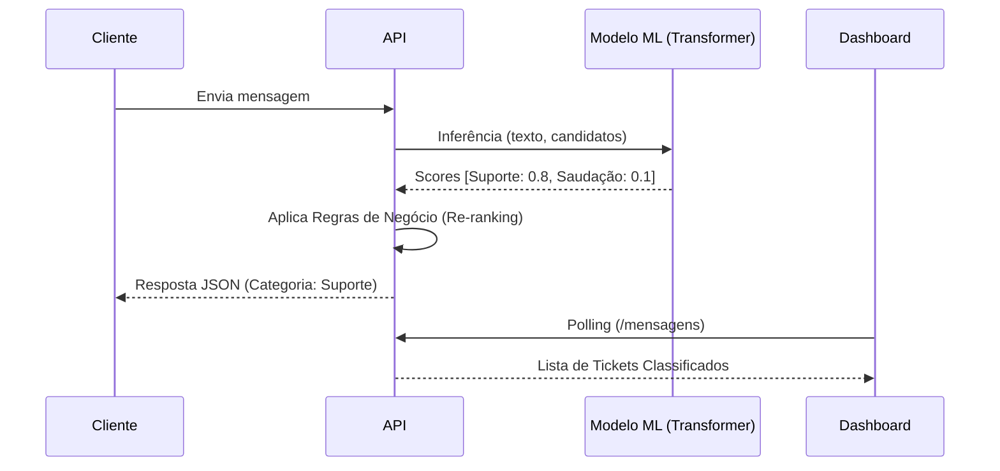

# Tutorial Técnico: API de Classificação de Mensagens com IA

Este tutorial descreve a implementação de uma API RESTful utilizando **FastAPI** que emprega **Machine Learning (NLP)** para classificar mensagens de texto. Diferente de abordagens baseadas em palavras-chave simples, este projeto utiliza um modelo **Transformer Zero-Shot** para entender a intenção semântica do usuário.

## 📋 Visão Geral do Projeto

O sistema recebe mensagens de usuários e as classifica em categorias predefinidas para direcionar o atendimento automaticamente.

- **Categorias Suportadas**: "Financeiro/Vendas", "Suporte Técnico", "Saudação", "Outros".
- **Tecnologia Principal**: `transformers` (Hugging Face) + `pytorch`.
- **Modelo Utilizado**: `valhalla/distilbart-mnli-12-1` (Versão destilada e eficiente do BART para classificação MNLI/Zero-Shot).

## �️ Pré-requisitos

Para rodar este projeto, certifique-se de ter:

- **Python 3.8+** instalado.
- **pip** atualizado.
- **Conexão com a Internet** (necessária na primeira execução para baixar o modelo de ~300MB).

## 🚀 Instalação e Configuração

### 1. Preparação do Ambiente

Clone o repositório ou extraia os arquivos em uma pasta local.

```bash
cd c:\Users\morei\OneDrive\Desktop\avaliacaoback
```

### 2. Instalação das Dependências

O projeto depende de bibliotecas de ML pesadas (`torch`, `transformers`). Instale-as via `requirements.txt`:

```bash
pip install -r requirements.txt
```

> [!IMPORTANT]
> A instalação do PyTorch pode demorar alguns minutos dependendo da sua conexão.

## ▶️ Executando a Aplicação

### Iniciando o Servidor

Para desenvolvimento, recomendamos utilizar o `uvicorn` com recarregamento automático (hot-reload):

```bash
uvicorn main:app --reload --port 8080
```

Se preferir rodar via script Python puro:
```bash
python main.py
```

> [!NOTE]
> **Primeira Execução**: Ao iniciar pela primeira vez, a aplicação fará o download automático dos pesos do modelo (`valhalla/distilbart-mnli-12-1`). Aguarde até ver a mensagem "Application startup complete".

O sistema estará disponível em: [http://localhost:8080/](http://localhost:8080/)

## 🖥️ Interfaces do Sistema

O projeto conta com duas interfaces frontend simples para demonstração:

### 1. 👤 Portal do Cliente
**URL**: [http://localhost:8080/](http://localhost:8080/)
- Interface limpa para o usuário final enviar suas dúvidas.
- Exibe o feedback instantâneo com a classificação e solução sugerida pela IA.

### 2. 🔧 Dashboard do Técnico
**URL**: [http://localhost:8080/tecnico](http://localhost:8080/tecnico)
- Visão estilo **Kanban** das mensagens recebidas.
- As mensagens são organizadas automaticamente nas colunas baseadas na classificação da IA.
- Atualização em tempo real (polling a cada 10s).

## 🧠 Arquitetura e Lógica de Classificação

Este é o diferencial técnico do projeto. Em vez de `if/else` com palavras-chave, usamos inferência probabilística.

### Fluxo de Processamento

1.  **Entrada**: Texto do usuário.
2.  **Inferência Zero-Shot**:
    - O modelo recebe o texto e uma lista de "rótulos candidatos" (Financeiro, Suporte, Saudação).
    - Ele calcula a probabilidade de o texto pertencer a cada rótulo baseando-se em implicação textual (Entailment).
    
3.  **Lógica de Re-ranking (Pós-processamento)**:
    - O modelo puro às vezes pode confundir uma saudação educada ("Olá, meu sistema quebrou") com a categoria "Saudação".
    - Implementamos uma lógica de prioridade em `classifier.py`:
      - Se a intenção principal for "Saudação", mas houver uma **intenção operacional** (Financeiro ou Suporte) com confiança significativa (score > 0.15), a intenção operacional vence.
      
4.  **Resultado**: Retorna a categoria vencedora, confiança e sugestões de ação.

### Diagrama de Sequência



## 🔍 Testando via API

Você pode testar diretamente via `curl` ou Postman:

**Exemplo - Solicitação de Suporte:**
```bash
curl -X POST "http://localhost:8080/classificar" \
     -H "Content-Type: application/json" \
     -d "{\"mensagem\": \"Meu login parou de funcionar e dá erro 500\"}"
```

**Resposta Esperada:**
```json
{
  "mensagem": "Meu login parou de funcionar e dá erro 500",
  "categoria": "Suporte Técnico",
  "confianca": "alta",
  "solucao_tecnica": "Verificar logs (Splunk) e abrir ticket Jira.",
  ...
}
```

## 📁 Estrutura de Arquivos

- `main.py`: Controlador principal (FastAPI) e rotas.
- `classifier.py`: Módulo de IA. Contém o pipeline do Hugging Face e a lógica de re-ranking.
- `static/`: Arquivos HTML/CSS/JS das interfaces.
- `requirements.txt`: Dependências do projeto.
